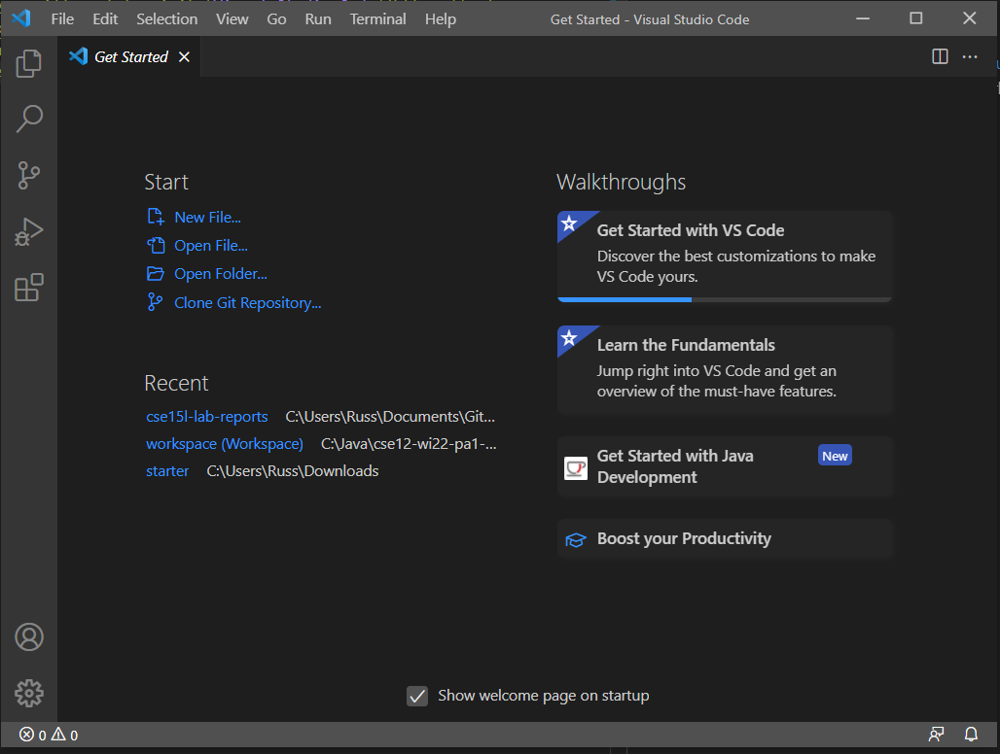
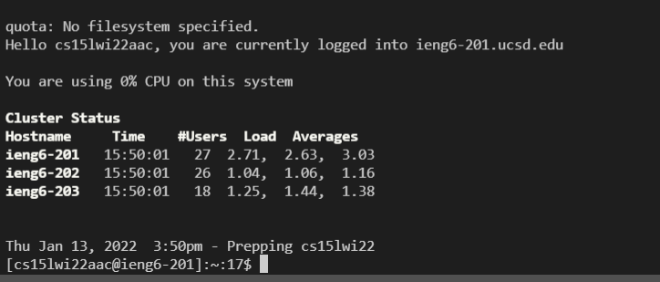
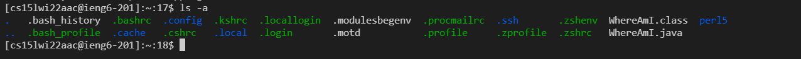
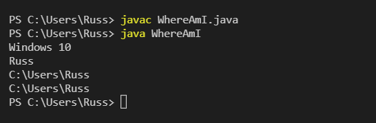
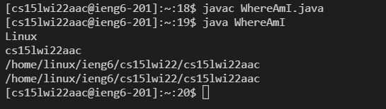
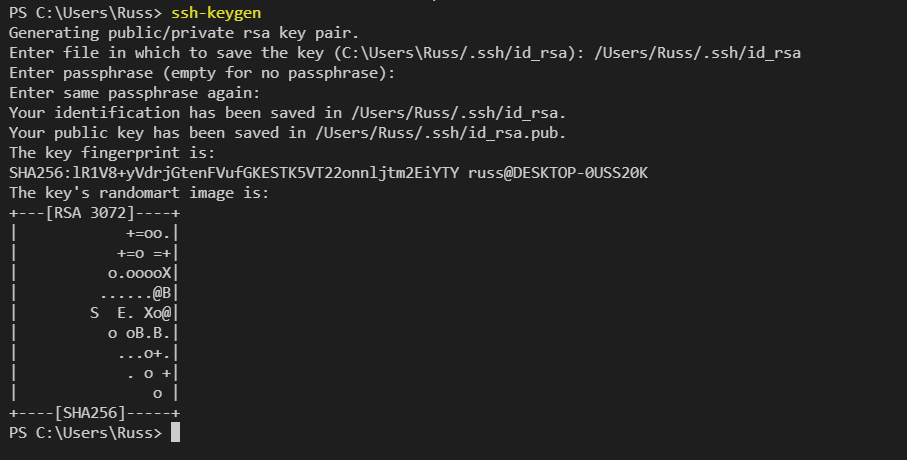
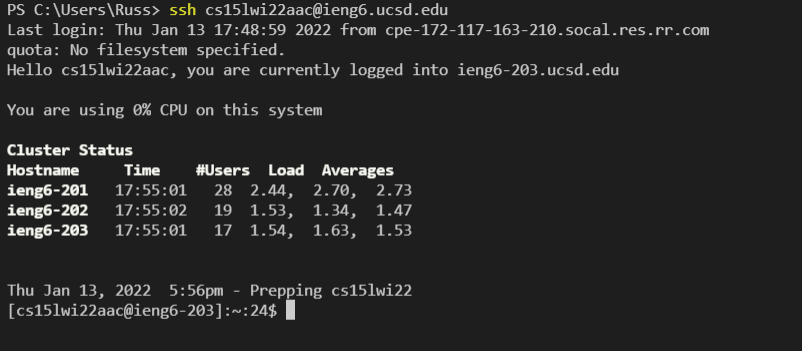
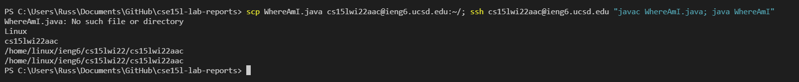

# Week 2 Lab Report
[__Back To Home Page__](https://russmaster76.github.io/cse15l-lab-reports/)

## Instaling Visual Studio
* Firstly, you will want to visit [Visual Studio Code](https://code.visualstudio.com/) and follow the instructions to download it onto your preferred workspace.

* When it is downloaded and opened, it should appear as it does below.



## Remote Connection
* You will need your account details for 15L, you can find them [here](https://sdacs.ucsd.edu/~icc/index.php) (*NOTE: If this is your first time, you will have to change/reset your password*)

* From the website above, you will find a username, this will be used for your remote access. This username will follow a convention and look similar to `cs15lwi22xxx`, with the wi22 differing depending on quarter, and the xxx being the personalized section.

* Now it is time to use Visual Studio from the first step, navigate to the top where it says `Terminal` and click `New Terminal`. 

* This will open a new terminal, which you can then type into. You will want to type in `ssh cs15lwi22xxx@ieng6.ucsd.edu`, where the `xxx` is your course specific account.

* If done sucessfully the terminal will ask `Are you sure you want to continue connecting`. Respond with `Yes`, and you will then be prompted to enter your password.

* After these steps, the terminal should appear as it does below.



## Running Commands
* When we are connected, there is a variety of commands we can try. 
* For Example
```
cd - changes the directory
cd ~ - changes to the home directory
ls - list files
ls -a - list all files
cat <file> - prints the contents of a file
```
* Below is an example of how a sucessfully ran command could look. In this case I used `ls -a`.



* *Note: To log out of the remote server from the terminal, you can use CTRL+D, or run the command* `exit`.

## Moving Files using `scp`
* First, we will want to create a java file on our computer titled `WhereAmI.java` that prints out the name of our OS, user, home, and directory. 
* This can be done by creating a new file in Visual Studio, Pasting the below code in, and Saving the file as `WhereAmI` in the java format.
```
class WhereAmI {
  public static void main(String[] args) {
    System.out.println(System.getProperty("os.name"));
    System.out.println(System.getProperty("user.name"));
    System.out.println(System.getProperty("user.home"));
    System.out.println(System.getProperty("user.dir"));
  }
}
```
* *Once this is done, you can try running the file by typing `javac WhereAmI.java`, clicking enter, and then following with `java WhereAmI`.*

* For the next step, you will want to be signed off of the server, as you will be logging in while you move the files
* Into the terminal, enter `scp WhereAmI.java cs15lwi22xxx@ieng6.ucsd.edu:~/`, of course with the `xxx` portion being replaced with your personal code.

* After this, you will be able to run the program on the server, this can be be done the same way it was offline, however, you should notice that the output of the program is different.

`Offline`



`Online (Signed in with SSH)`



## Creating an SSH Key

* First you will want to open your Visual Studio Terminal, offline. and type `ssh-keygen` in. 
* It will then ask for a location to save the key, you may follow the picture below, but make sure to change the user.



* When this is complete, ssh back into the server using  `ssh cs15lwi22xxx@ieng6.ucsd.edu`. Once on the server, you will make a directory to store the key by using the command `mkdir.ssh`

* You will then want to log out of the server, then offline, copy the public key into the server's `.ssh` directory you created using the following command 
* `scp /Users/russ/.ssh/id_rsa.pub cs15lwi22xxx@ieng6.ucsd.edu:~/.ssh/authorized_keys`
* *Note: Make sure to use the proper user, location, and sign in details when following this step, do not just copy the command without changing it.*
* If successful, you will not have to input your password, similar to in the image below



## Optimizing Remote Running

* In order to optimize remote running, you can type multiple commands in one line.

* Using `WhereAmI.java` as an example, to copy it to the server,connect to the server, compile, and run it in one line we can use
```
scp WhereAmI.java cs15lwi22xxx@ieng6.ucsd.edu:~/; ssh cs15lwi22xxx@ieng6.ucsd.edu "javac WhereAmI.java; java WhereAmI"
(Switching the xxx with your Personal Code)
```
* If this is done properly, then it should do all that was said above. The reason this works is just due to syntax, using semicolons will end one command, and then the contents inside the quotation marks will be run after we are connected to the server.

* Proper usage should reflect the image below.



* Running the code on one line will save time as we do not have to wait for each line to execute. It also allows us to save the amount times we have to write `ssh`, as we would have to use that on most lines.
* By doing this, we can save both keystrokes and time. Reducing keystrokes to 10 in proper situations.

```
1 keystroke on the up arrow to get to the previous command
1 keystroke to add a semi colon
3 keystrokes to copy in your ssh username
5 keystrokes to copy paste the file that you are compiling and running, which in this case is WhereAmI.java.
```
