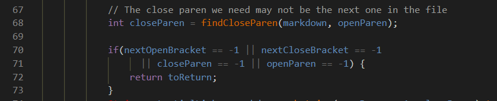
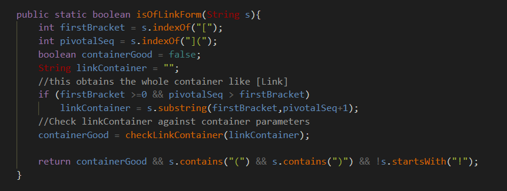

# Week 10 Lab Report

[__Back To Home Page__](https://russmaster76.github.io/cse15l-lab-reports/)

# Finding Different Results

- In order to find test that had different results, we had to run `MarkdownParse` on the 652 commonmark-spec tests on the versions of `MarkdownParse` that we had. (Both our groups implementation, as well as the one that was given in week 9)

- So that we could run all these test, we used given bash file `script.sh`. This iterated through all the test files and ran the commands necessary to run the program with the given file.

- *`script.sh` runs `java MarkdownParse $file`, `file` being the given test file*

```
script.sh

for file in test-files/*.md;
do
    echo $file
    java MarkdownParse $file
done
```

- In order to properly run `script.sh` on the command line, the command used was `bash script.sh > results.txt`, this will make it so `results.txt` will hold the results of each test file being run with `MarkdownParse.java`.

- *The results from our implementation are stored in `results1.txt`*

- These commands were run on both my groups implementation of `MarkdownParse.java`, as well as the one given in the week 9 lab. They both stored the results of the test in their own `results.txt`.

- After both of these are run, we can use the command `diff` to compare the results of `script.sh` from both implementations.

- Once done running the `diff` command, that highlighted the differences, I went into result.txt to find the results and see which test files the differences were from. We were able to do this because of the  `echo $file` in `script.sh`.

## Test 1

- Below is test file 201.md

```
[foo]: <bar>(baz)

[foo]
```

- Output from Week 9 MarkdownParse `[baz]`

- Output from Group Implementation `[]` (empty)

- The output from my groups implementation is correct, as the given test file doesn't contain a link.



- I believe that the problem with the Week 9 MarkdownParse implementation is that it checks if a link is valid only if the open parentheses come right after a closed bracket, which is not the case in the given test file.

## Test 2 

- Below is test file 516.md

```
[](/uri)
```

- Output from Week 9 MarkdownParse `[/uri]`

- Output from Group Implementation `[moon.jpg)](/uri]`

- The implementation from Week 9 Markdown parse is correct, as it contains the link that is present within the test file.



- I think that the bug in the implementation of my group is that the code checks for the first sequence of `(]` within a given file. This is normally at the beginning of the link, however, the test file provided has two instances of this, and because of the link is contained within the second one, it is not returned. In order to fix this, we must adjust the code to not stop after the first instance of `(]` and look at the last index as well.