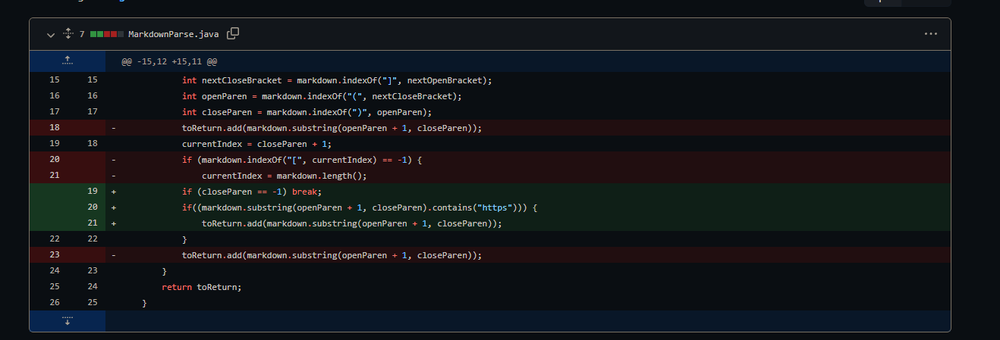
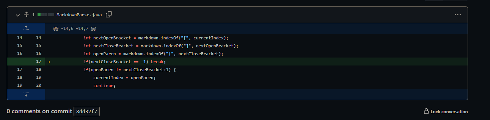

# Week 2 Lab Report
[__Back To Home Page__](https://russmaster76.github.io/cse15l-lab-reports/)

# First Bug Fix
## Code Change and Bug
__Bug:__ The bug in this situation was that when using the test file, two links were intended to print. However, only one of the links we had printed.


## Failing Test File

[Failing Test File on GitHub](https://github.com/russmaster76/markdown-parse/blob/main/test-file.md?plain=1)

Code Within Test File
```
# Title
[a link!](https://something.com)
[another link!](some-page.html)
```
## Symptom of Failure Inducing Input


## Relationship Between Bug, Symptom, and Failure-inducing input
* The cause of bug is due to the fact that in trying to make it so our program would not print images, we made it so that it would only print strings that contained `https`. Because the second website we were given, `some-page.html` did not contain `https`, it was not printed
* The relationship between these three aspects is that we did not account for all possible names websites could have, and therefore when attempting to run the failure-inducing output, the symptom was an inaccurate output of our tester file. This shows that we had something in our code that was making one thing print, yet preventing another.


# Second Bug Fix

## Code Change and Bug
__Bug:__ The bug that was fixed in this scenario is that when an image was put into the program, it would return the name of the file that contained the image. As the purpose of this program is to return links, this should not occur. There is also a website linked that should print, and was printing throughout testing.



## Failing Test File
[Failing Test File on GitHub](https://github.com/russmaster76/markdown-parse/blob/main/test2.md?plain=1)

Code Within Test File
```

[link](https//:something.com)
```

## Symptom of Failure Inducing Input


## Relationship Between Bug, Symptom, and Failure-inducing input
*  The cause of the bug is that there is no filter for what the given code will print, therefore it could print basically anything. Since we want it to fulfill a certain purpose, we must make it so it can do that purpose alone as to not confuse the machine or users. 
* The relationship between these three aspects is the lack of of a filter for the Failure Inducing Input, which then leads to the bug and the symptom being printed. The symptom being that a line of text is printed for the image when it shouldn't be, therefore showing us that there is an error in our code. This fix did cause another problem, shown in the first bug fix, however, we were able to fix that as well.

# Third Bug Fix

## Code Change and Bug
__Bug:__ The bug in this situation was that when a test file with no close bracket was tested in the program, the program would enter an infinite loop, searching for a close bracket that doesn't exist. Instead, the program should just return empty brackets, as no links are provided.



## Failing Test File

[Failing Test File on GitHub](https://github.com/russmaster76/markdown-parse/blob/main/test4.md?plain=1)

Code Within Test File
```
)[
```


## Symptom of Failure Inducing Input


## Relationship Between Bug, Symptom, and Failure-inducing input
* The cause of the bug is that the program continued to search the file for a close bracket, even though there was none. Because there was none, it will just continue to search infinitely.
* The relationship between these three aspects is that the bug resulted in the symptom of an infinite loop. And the failure inducing input, the test file, was what showed the symptom.