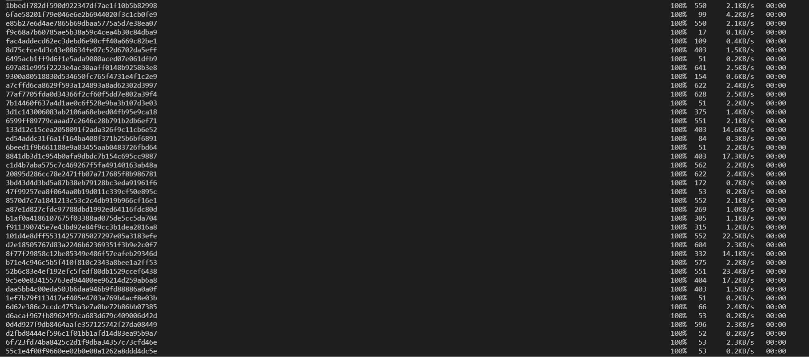

# Week 6 Lab Report

[__Back To Home Page__](https://russmaster76.github.io/cse15l-lab-reports/)

# Copying Whole Directories with scp -r

# Copying Everything

- In order to copy a whole directory, you can use the command `scp -r . cs15lwi22xxx@ieng6.ucsd.edu:~/markdown-parse`, with the xxx being replaced with your own login key.
- When this action is done, the files in the local directory will be copied to a directory named after the file/directory that you are copying to the server.




# Compiling and Running the Copied Directory

- When this transfer has been completed, we can compile and run the copied files.
- The first step will be logging onto the server using `ssh cs15lwi22xxx@ieng6.ucsd.edu`, with the xxx being replaced with your own login key.
- Once you are logged onto the remote server, you can use `cd markdown-parse` (Or whatever directory you copied) to bring you to the directory. After this, you can run the test by using the following commands in succession.

```
javac -cp .:lib/junit-4.13.2.jar:lib/hamcrest-core-1.3.jar MarkdownParseTest.java

java -cp .:lib/junit-4.13.2.jar:lib/hamcrest-core-1.3.jar org.junit.runner.JUnitCore MarkdownParseTest
```

*Since the whole directory was copied over, it is likely that `.class` files were included, which can cause issues when running the test on the server. If you run into these errors, you can remove the class files from the directory using the `rm` command followed by the files you'd like to remove*


# Combining scp, ; , and ssh to copy directory and run test in one line

- In order to run these commands in one line, a fairly long command is necessary. It can be seen below

```
scp -r . cs15lwi22xxx@ieng6.ucsd.edu:~/markdown-parse2; ssh cs15lwi22xxx@ieng6.ucsd.edu "cd markdown-parse2; rm MarkdownParseTest.class; rm MarkdownParse.class; /software/CSE/oracle-java-se-14/jdk-14.0.2/bin/javac -cp .:lib/junit-4.13.2.jar:lib/hamcrest-core-1.3.jar MarkdownParseTest.java; /software/CSE/oracle-java-se-14/jdk-14.0.2/bin/java -cp .:lib/junit-4.13.2.jar:lib/hamcrest-core-1.3.jar org.junit.runner.JUnitCore MarkdownParseTest"
```

- *Again, xxx must be replaced with your login credentials. Also, in this example, we copy everything into markdown-parse2, as a directory named markdownparse already exists on the server*


- *Some pictures of copying over directory omitted, however, they are the same as seen in part one.*
