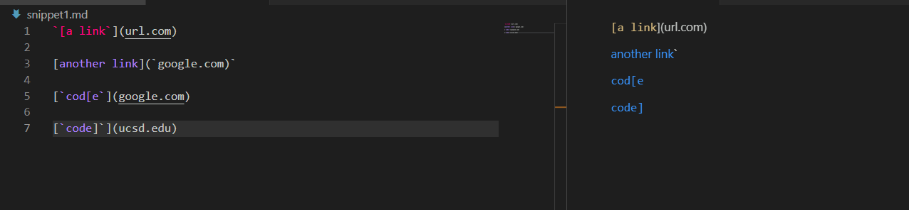
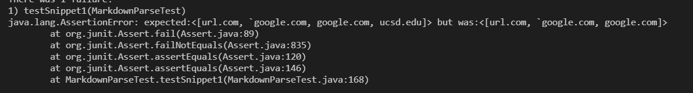
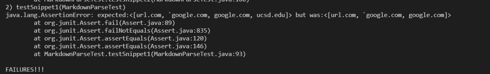
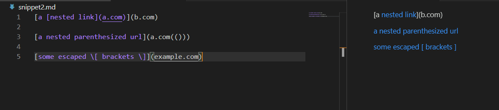
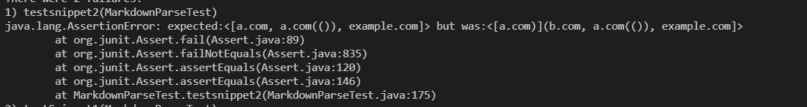
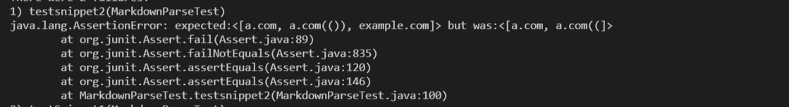
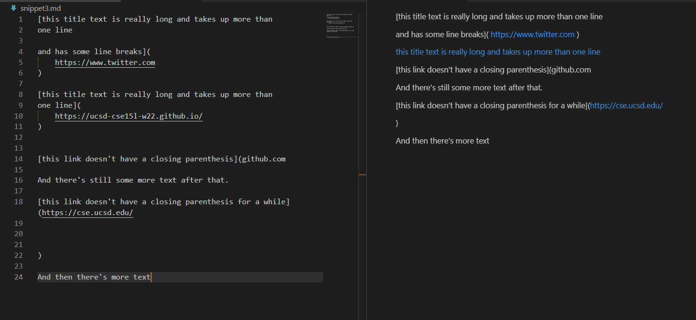
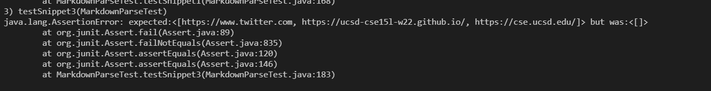

# Week 8 Lab Report

[__Back To Home Page__](https://russmaster76.github.io/cse15l-lab-reports/)

# Code Snippet 1

## Preview



```
`[a link`](url.com)

[another link](`google.com)`

[`cod[e`](google.com)

[`code]`](ucsd.edu)
```

## Expected Result from MarkdownParse

- According to the VSCode preview, the last two links were clickable, despite the fact that they were in code snippets, therefore they should be considered links in MarkdownParse
- The first two links were clickable, therefore they should be returned by markdown parse.

## Junit Tester Code

```
@Test
    public void testSnippet1() throws IOException {
    Path fileName = Path.of("snippet1.md");
    String contents = Files.readString(fileName);
    assertEquals(List.of("url.com", "`google.com", "google.com","ucsd.edu"), MarkdownParse.getLinks(contents));
    }
```

## Group Implementation Tester Output



## Reviewed Group Tester Output



## Fixing Test Questions

- I do believe that there is a small code change that can fix this problem with snippet 1. The code we use looks at the given file on a line by line basis, and we can change the code to look for backticks within the line. If there is a backtick contained, we can ignore the contents that are within the backticks.

# Snippet 2

## Preview



```
[a [nested link](a.com)](b.com)

[a nested parenthesized url](a.com(()))

[some escaped \[ brackets \]](example.com)
```

## Expected Result from MarkdownParse

- In this snippet, the expected results would be a.com, a.com(()), and example.com. These should all be returned by MarkdownParse.
- The reason for this is that all the links are valid, even if they are only in certain portions of the given words, they are still present.

## Junit Tester Code

```
@Test
    public void testSnippet2() throws IOException{
        Path fileName = Path.of("snippet2.md");
        String contents = Files.readString(fileName);
        assertEquals(List.of("a.com", "a.com(())", "example.com"),
            MarkdownParse.getLinks(contents));
    }
```

## Group Implementation Tester Output



## Reviewed Group Tester Output



## Fixing Test Questions

- I do believe that there is a fix that can be done for snippet 2 in a small amount of code. The test showed that everything was returned properly except for the first link. This means that there is likely only a small problem. Our MarkdownParse already covers the case of multiple parentheses, therefore we can likely just improve that section to make the code work for snippet 2.

# Snippet 3

## Preview



```
[this title text is really long and takes up more than 
one line

and has some line breaks](
    https://www.twitter.com
)

[this title text is really long and takes up more than 
one line](
    https://ucsd-cse15l-w22.github.io/
)


[this link doesn't have a closing parenthesis](github.com

And there's still some more text after that.

[this link doesn't have a closing parenthesis for a while](https://cse.ucsd.edu/


)

And then there's more text
```

## Expected Result from MarkdownParse

- In this situation, we should return three different links of those given to us in this large snippet.
- We can tell this by looking at the preview, as there are three clickable links in the preview, and these should be returned by MarkdownParse.

## Junit Tester Code

```
@Test
    public void testSnippet3() throws IOException{
        Path fileName = Path.of("snippet3.md");
        String contents = Files.readString(fileName);
        assertEquals(List.of("https://www.twitter.com", "https://ucsd-cse15l-w22.github.io/", "https://cse.ucsd.edu/"),
            MarkdownParse.getLinks(contents));
    }
```

## Group Implementation Tester Output



## Reviewed Group Tester Output

- The code from the group that I was testing and reviewing for passed this test concerning snippet3.

## Fixing Test Questions

- I believe that making snippet3 would be a more robust process, and could likely not be done within 10 lines or less. Our code looks at the given markdown file on a line by line basis, and assumes that each line contains both the link container as well as the link itself. Because of this, it would be very difficult to make it work within a markdown file with so many newlines. One change could involve making a more involved system to read parentheses matching over multiple indexes in the MarkdownParse array.
